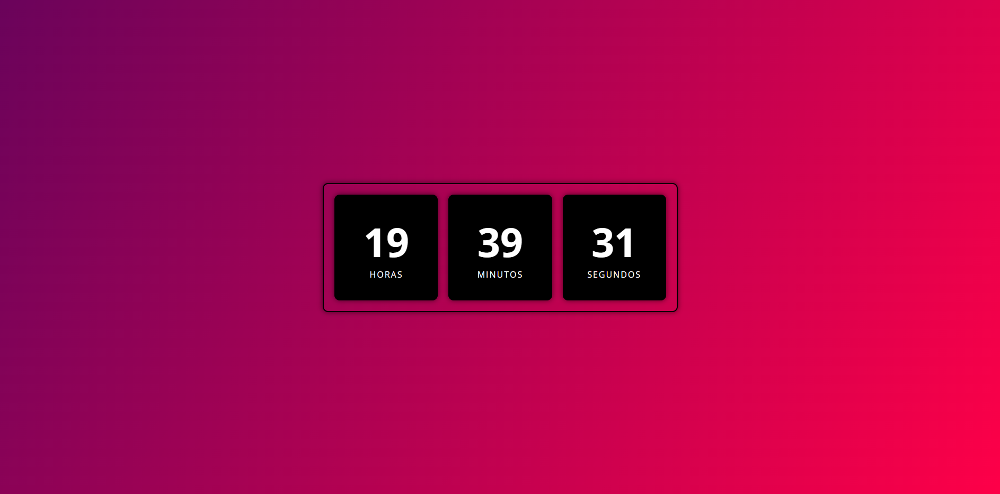

# Projeto Relógio Digital

Página web simples que exibe um relógio digital em tempo real, mostrando horas, minutos e segundos com um design moderno e responsivo.

## Descrição

Este projeto apresenta um relógio digital atualizado a cada segundo utilizando JavaScript para capturar a hora atual do sistema. A interface é estilizada com CSS para proporcionar um visual elegante, usando um gradiente de fundo, caixas com sombras e fontes legíveis.

## Tecnologias utilizadas

- HTML5
- CSS3
- JavaScript (Vanilla)

## Visual do projeto

  

## Como usar

1. Clone ou baixe este repositório.
   ```bash
   git clone https://github.com/Caua-Ricken/relogio.git
2. Abra o arquivo `index.html` em seu navegador.
3. Veja o relógio funcionando em tempo real.

Feito por Cauã Ricken.

